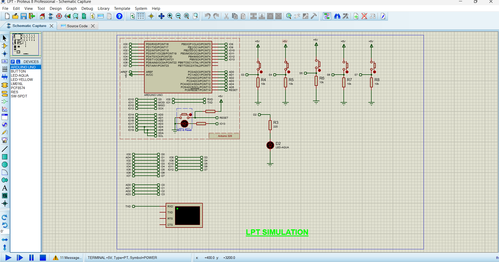

# Arduino-LPT-Emulation-Library


Bibliothèque d'émulation du port parallèle standard IEEE 1284 (LPT / Centronics) pour microcontrôleurs ATmega328P (Arduino Uno / Nano), conçue spécialement pour le prototypage et la simulation sous **Proteus VSM (ISIS)**.


Vous trouverez également la bibliothèque Arduino dans le dossier `lib_arduino`

---

## 📌 Présentation

Cette bibliothèque permet d'utiliser les fonctions historiques en C/C++ de bas niveau du monde PC x86 (`inportb()` et `outportb()`) pour piloter un périphérique parallèle virtuel ou réel directement depuis Arduino.Deplus cette bibliotheque remplace `Serial.println()` par `pritnf()` pour les familiers a turbo c++

Elle simule les adresses mémoires standard de la carte mère :
* **`0x378` (Data Register)** : Sortie 8 bits de données.
* **`0x37A` (Control Register)** : Sortie des signaux de contrôle (Strobe, AutoFeed, Init, Select Input).
* **`0x379` (Status Register)** : Lecture des signaux d'état (Busy, Ack, Paper End, Select, Error).

---

## ⚠️ Important : Le rôle clé de `initLPT()` dans `setup()`

L'appel à `initLPT()` dans la fonction `void setup()` est **obligatoire** avant toute lecture ou écriture.

```cpp
void setup() {
    initLPT(); // OBLIGATOIRE : Initialise les registres de direction DDRx
    // ... reste de votre code
}
```

EXEMPLE CODE 

```CPP
#include<LPT.h>

void setup () {
   initLPT();//initLPT is oblication
   outportb(0x378,0x04); // DATA PORT OUT ON D2
   outportb(0x37A,0x01); // CMD PORT;
   printf(2); // TEST PRINTF
   
// TODO: put your setup code here, to run once:

}


void loop() {
   int val = inportb(0x379); //READ DATA OF STATE  REGISTER
   printf(val,HEX); 
   delay(1000);
// TODO: put your main code here, to run repeatedly:

}
```
